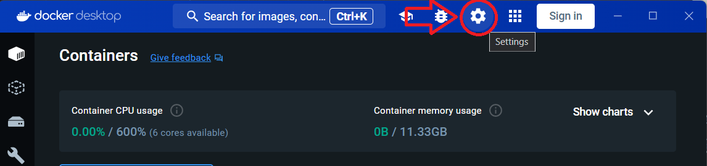
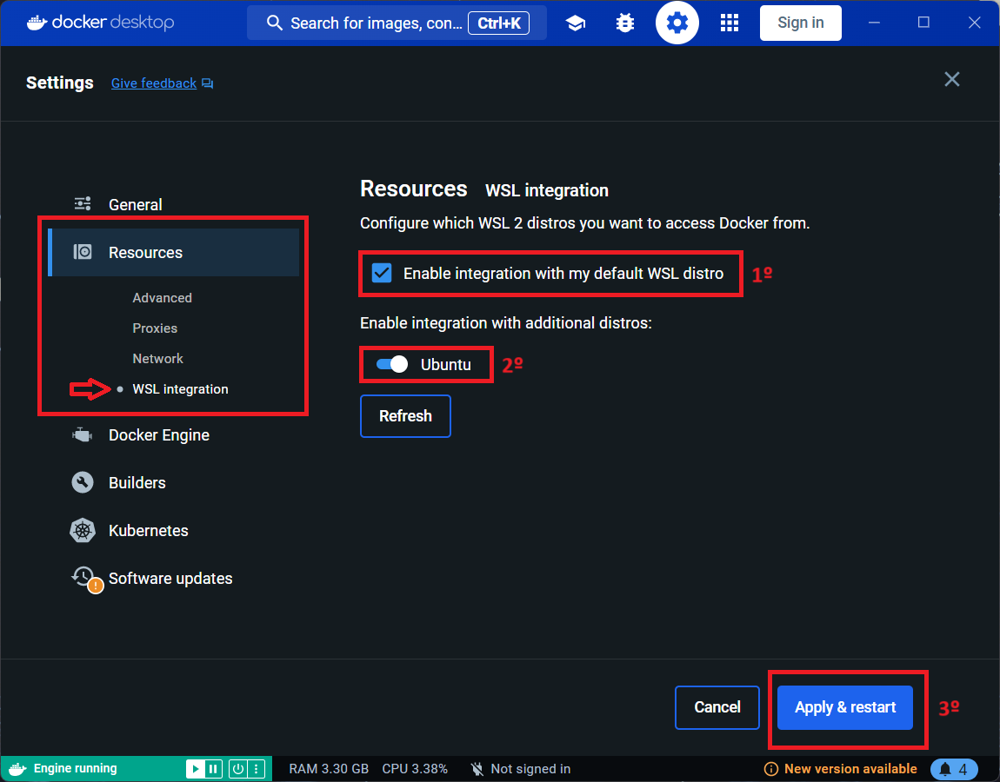
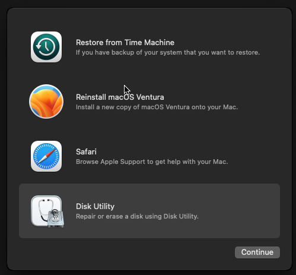

# Executando macOS pelo windows através do WSL

Configuração e execução do macOS pelo WSL para criação de um ambiente de desenvolvimento iOS (para usuários de Android e Windows 🫤).

<span style="display:block; height:0.5em;"></span>

<div align='center'>
    
    
    
    
    
</div>

<!--
    -->

<br>

## 1. Ativar o Subsistema do Windows para Linux (WSL)

<span style="display:block; height:0.5em;"></span>

1.1. No campo de pesquisa do windows, buscar por `Ativar ou Desativar Recursos do Windows`

<span style="display:block; height:0.5em;"></span>

<div align='center'>
    
</div>

<span style="display:block; height:0.5em;"></span>

## 2. Instalar o Ubuntu no WSL

<span style="display:block; height:0.5em;"></span>

2.1. Abrir o Prompt de Comando (CMD) como administrador

2.2. Executar o comando abaixo:

```bash
wsl --install
```

2.2.1. O comando acima deverá iniciar a instalação do Ubuntu, caso fique travado em `[ 0.0% ]`, execute o comando `CTRL+C` para interromper e use o comando abaixo:

```
wsl --install Ubuntu --web-download
```

2.2.2. Ao final da instalação, o ubuntu estará executando via terminal.

2.3. Atualize o ubuntu executando o comando abaixo:

```bash
sudo apt update
```

2.3.1. Em seguida use o comando:

```bash
sudo apt upgrade
```

<span style="display:block; height:0.5em;"></span>

## 3. Instalação de programas necessários para integração do macOS com o windows

<span style="display:block; height:0.5em;"></span>

3.1. Instalação de aplicações gráficas baseadas em X11:

```bash
sudo apt install x11-apps -y
```

3.2. Instalação dos pacotes `bridge-utils`, `cpu-checker`, `libvirt-clients` e `libvirt-daemon`:

- `bridge-utils`: Este pacote fornece utilitários para configurar e gerenciar pontes de rede. As pontes de rede são usadas para conectar várias interfaces de rede em uma única rede lógica.

- `cpu-checker`: Este pacote não está diretamente relacionado à virtualização, mas é útil para verificar se o seu processador suporta extensões de virtualização (como Intel VT-x ou AMD-V).

- `libvirt-clients` e `libvirt-daemon`: Esses pacotes fazem parte do conjunto de ferramentas libvirt, que é usado para gerenciar máquinas virtuais. O libvirt-clients fornece utilitários de linha de comando para interagir com o daemon libvirt, enquanto o libvirt-daemon é o próprio daemon que gerencia as operações de virtualização.


```bash
sudo apt -y install bridge-utils cpu-checker libvirt-clients libvirt-daemon
```

3.3. Verificar se está preparado para instalação do macOS através do comando:

```bash
kvm-ok
```

**Obs.:** Deve aparecer a mensagem `KVM acceleration can be used`. Se não aparecer, necessário executar os passos anteriores novamente 🫤🤷‍♂️.

<span style="display:block; height:0.5em;"></span>

## 4. Criação e Configuração do .wslconfig

<span style="display:block; height:0.5em;"></span>

4.1. Acessar a pasta de usuário pricipal do windows

```
Ex: C:/Users/<UserName>
```

4.2. Verificar se o arquivo `.wslconfig` existe na raiz do diretório, caso contrário, criar o arquivo com este nome.

4.2.1. Criar Novo > Documento de Texto

4.2.2. Apagar o nome e a extensão (.txt) e salvar como `.wslconfig`

4.3. Abrir o arquivo pelo **Bloco de Nootas** e salvar com o seguinte conteúdo:

```
[wsl2]
nestedVirtualization=true
```

<span style="display:block; height:0.5em;"></span>

## 5. Docker

<span style="display:block; height:0.5em;"></span>

5.1. Baixe e instale o **Docker Desktop** no windows

5.2. Depois de instalar, execute e acesse `Configurações`:

<span style="display:block; height:0.5em;"></span>

<div align='center'>
    
</div>

<span style="display:block; height:0.5em;"></span>

5.3. Na tela de `Configurações`, pela barra lateral navegar até `Resources > WSL Integration`

5.4. Habilitar a integração com a distro padrão do **WSL** e a integração adicional com a distro **Ubuntu**:

<span style="display:block; height:0.5em;"></span>

<div align='center'>
    
</div>

<span style="display:block; height:0.5em;"></span>

## 6. Baixar macOS Ventura

<span style="display:block; height:0.5em;"></span>

6.1. Abrir o CMD como administrador e executar o comando abaixo para executar o **Ubuntu**:

```bash
wsl -d ubuntu
```

6.2. Copie e cole o bloco de codigo abaixo no terminal do **Ubuntu**:

```bash

docker run -it \
    --device /dev/kvm \
    -p 50922:10022 \
    -v /tmp/.X11-unix:/tmp/.X11-unix \
    -e "DISPLAY=${DISPLAY:-:0.0}" \
    -e GENERATE_UNIQUE=true \
    -e MASTER_PLIST_URL='https://raw.githubusercontent.com/sickcodes/osx-serial-generator/master/config-custom.plist' \
    sickcodes/docker-osx:ventura

```

**Obs.:** O codigo acima foi copiado do repositório github <a href='https://github.com/sickcodes/Docker-OSX'>Docker-OSX</a>, que disponibiliza outras versões do macOS para virtualização pelo **WSL**. Para o exemplo foi utilizado o **Ventura**, sendo a versão mais atual disponível.

6.3. Ao Executar o comando, irá iniciar uma tela para continuação da instalação do sistema pelo **QEMU**, sendo um virtualizador e emulador de máquina virtual de código aberto.


6.3.1. Aperte o comando `Ctrl` + `alt` + `F` para deixar em tela cheia.

6.3.2. Selecione a opção `macOS Base System`

6.3.2. Selecione `Disk Utility` e pressione `Continuar`:

<span style="display:block; height:0.5em;"></span>

<div align='center'>
    
</div>

<br>

## ...


<br>

##### Referências

<b>Diolinux</b>, A Apple não vai gostar dessa! | macOS em qualquer PC via Docker. Disponível em: <br>
<a href='https://www.youtube.com/watch?v=dyd2bQbFo1Q&t=338s'>https://www.youtube.com/watch?v=dyd2bQbFo1Q&t=338s</a><br>


<b>iTechnolando</b>, Enlouquecemos a Apple de novo, Veja como Instalar o macOS 13 Ventura direto no Windows. Disponível em: <br>
<a href='https://www.youtube.com/watch?v=8O0OHr1R_141'>https://www.youtube.com/watch?v=8O0OHr1R_14</a>